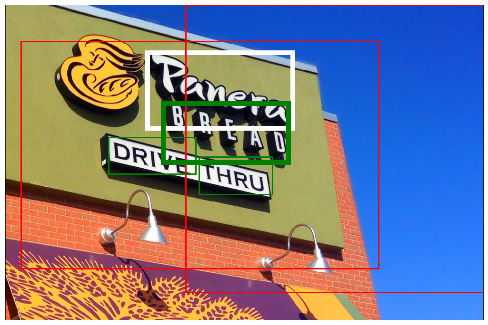

## Multi-Modal GNN for TextVQA

[](LICENSE)
[](https://www.python.org/)


1. This project provides codes to reproduce the results of 
[Multi-Modal Graph Neural Network for Joint Reasoning on Vision and Scene Text](https://arxiv.org/abs/2003.13962 "arxiv link") on TextVQA dataset
2. We are grateful to [MMF (or Pythia)](https://github.com/facebookresearch/mmf "MMF's Github repo"), an 
excellent VQA codebase provided by Facebook, on which our codes are developed
3. We achieved 32.46% accuracy (ensemble) on test set of TextVQA

### Requirements

1. Pytorch 1.0.1 post
2. We have performed experiments on Maxwell Titan X GPU, which has 12GB of GPU memory
3. See [`requirements.txt`](requirements.txt) for the required python packages and run to install them

Let's begin from cloning this repository
```
$ git clone https://github.com/ricolike/mmgnn-textvqa.git
$ cd mmgnn-textvqa
$ pip install -r requirements.txt
```

### Data Setup

1. **cached data:** To boost data loading speed under limited memory size (64G) and to speed
up calculation, we cached intermediate dataloader results in storage. Download 
[data](https://drive.google.com/drive/folders/1Y8E-afg9aRHn6VblSWGNd0hvQGEW9ILS?usp=sharing) 
*(around 54G, and around 120G unzipped)*, and modify 
line 11 (`fast_dir`) in [config](pythia/common/defaults/configs/tasks/vqa/textvqa.yml)
to the absolute path where you save them
2. **other files:** Download other needed files (vocabulary, OCRs, some parameters of 
backbone) [here](https://drive.google.com/file/d/1ieIx4MB49DBm1ycY203f15kvcrX4IoLt/view?usp=sharing) 
*(less than 1G)*, and make a soft link named `data` under repo root towards where you saved them

### Training
1. Create a new model folder under `ensemble`, say `foo`, and then copy [our config](configs/vqa/textvqa/s_mmgnn.yml) 
into it  
```
$ mkdir -p ensemble/foo
$ cp ./configs/vqa/textvqa/s_mmgnn.yml ./ensemble/foo
```
2. Start training, and parameters will be saved in `ensemble/foo`
```
$ python tools/run.py --tasks vqa --datasets textvqa --model s_mmgnn --config ensemble/foo/s_mmgnn.yml -dev cuda:0 --run_type train`
```
3. First-run of this repo will automatically download glove in `pythia/.vector_cache`, 
let's be patient. If we made it, we will find a `s_mmgnnbar_final.pth` in the model folder `ensemble/foo`

### Inference

1. If you want to skip training procedure, 
a [trained](https://drive.google.com/file/d/1P1k3sNAQnV7dUovypt1zKwCTNgCEDHua/view?usp=sharing) model is provided
on which we can directly do inference
2. Start inference by running the following command. And if you made it, you will find three new files generated under the model folder, two ends with `_evailai.p` are ready to be submitted to [evalai](https://evalai.cloudcv.org/web/challenges/challenge-page/244/leaderboard/809) to check the results
```
$ python tools/run.py --tasks vqa --datasets textvqa --model s_mmgnn --config ensemble/bar/s_mmgnn.yml --resume_file <path_to_pth> -dev cuda:0 --run_type all_in_one
```


### Bibtex
```
@inproceedings{gao2020multi,
  title={Multi-modal graph neural network for joint reasoning on vision and scene text},
  author={Gao, Difei and Li, Ke and Wang, Ruiping and Shan, Shiguang and Chen, Xilin},
  booktitle={Proceedings of the IEEE/CVF Conference on Computer Vision and Pattern Recognition},
  pages={12746--12756},
  year={2020}
}
```

### An attention visualization

  
**_Question: "What is the name of the bread sold at the place?"_**  
**_Answer: "Panera"_**  
(where white box is the answer predicted, green boxes are OCRs **_Panera_** attends to, and 
red boxes are visual ROIs **_Panera_** attends to; box weight indicating attention strength)
